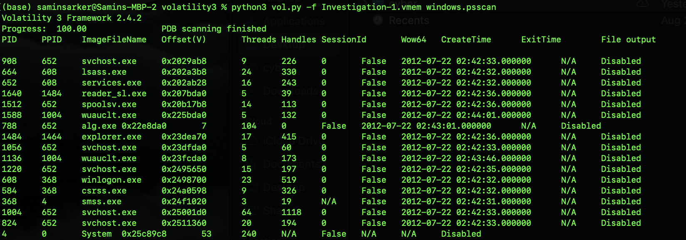
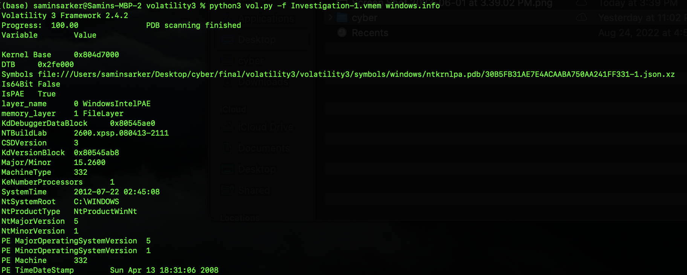

## Intro

Volatility is a memory forensics tool that is used to extract information from memory images (memory dumps) of different OS systems.

It is the most widely used framework to extract digital artifacts and information from volatile memory or RAM.

Some uses of Volatility include listing running processes, closed/open networks, internet history, hashed passwords, and retrieving commands entered into the terminal.


## Under the Hood

The tool splits memory analysis into 3 components `memory layers`, `templates and objects`, and `symbol tables`.

| Component                 | Description   |
| -------------             | ------------- |
| **memory layers**         | represented as a `directed graph` in volatility and makes use of requesting addresses from the layer to retrive data |
| **templates and objects** | upon addressing a section of memory pulls objects and templates to attain information of the structures |
| **symbol tables**         | a list of symbols, addresses or `templates`, that specifies the keywords taken by the compiler|


## Notes

- Volatility uses multiple plugins to extract information from a memory dump

- Before analysis you must identify the type of memory dump image → ```python3 vol.py -f <FILENAME> imageinfo```

- Extracting the memory itself can be performed in a variety of ways and using multiple tools which most often output a .raw file

- To see the possible plugins use the help menu of volatility ```python3 vol.py -h```

- To use plugin follow format ```python3 vol.py -f <FILENAME> <OSname>.<PLUGINname>```


## List of Plugins

| Plugin        | Description   |
| ------------- | ------------- |
| **info**      | information about the host running the memory dump |
| **pslist**    | will return the list of processes running from a doubly linked list that tracks processes from the memory; similar to the process list in task manager |
| **psscan**    | another way to identify running processes but by finding data structures that match ```E_PROCESS```; can help against malware evasion measures |
| **pstree**    | another way to identify processes using parent process id; provides a more fuller description of processes during extraction |
| **netstat**   | identifies all memory structures with a network connection |
| **dlllist**   | lists all the DLLs associated with processes at the time of extraction |
| **malfind**   | identifies any injected processes and their PIDs along with their offset address; works by scanning heaps and identifying processes with the executable bit set RWE or RX |
| **hashdump**  | extracts all the username and password hashes from the machine |


## Example Outputs




## Our own plugin

> simple plugin to list all PIDs and their names

```python
from volatility3.plugins.windows import pslist
from volatility3.framework.interfaces import plugins
from typing import List
from volatility3.framework import renderers, interfaces
from volatility3.framework.configuration import requirements

class OwnPlugin(plugins.PluginInterface):
    tuple_version = (2, 0, 0)
    _required_framework_version = tuple_version

    @classmethod
    def get_requirements(cls):
        component1 = requirements.TranslationLayerRequirement(name='primary')
        component2 = requirements.SymbolTableRequirement(name='symbols')
        return [component1, component2]

    def run(self):
        primary = self.config['primary']
        symbols = self.config['symbols']
        tasks = pslist.PsList.list_processes(self.context, primary, symbols)
        return renderers.TreeGrid([("Process ID", int), ("Image Name", str)], self._generator(tasks))
    
    def _generator(self, data):
        for task in data:
            pid = int(task.UniqueProcessId)
            filename = task.ImageFileName.cast("string",  max_length = task.ImageFileName.vol.count, errors = 'replace')
            yield (0, [pid, filename])
```

- place plugin in directory ```volatility3/plugins/windows```

- to run your own plugin follow format ```python3 vol.py -f <Filename> windows.<PluginFileName>.<PluginClassName>``` 


## Dictionary

- ```Memory image```: a programming pattern in which data stored in the database resides in the memory → more simply it is a copy/snapshot of a machines virtual memory saved to a file for easier analysis and viewing

- ```DLLs or dynamically linked library```: a collection of small programs that large programs can load and can be used spontaneously by many

- ```Memory layer```: a group of data that can be accessed by making requests at a specified address

- ```Directed graph```: a type of graph or node connection connected by edges with directions

- ```Template```: contains all information attainable about the structure of an object without any actual data writtern


## Other Resources

- [Official Website for Volatility](https://www.volatilityfoundation.org/)

- [Volatility Docs](https://volatility3.readthedocs.io/en/latest/index.html)

- [List of commands cheatsheet](https://book.hacktricks.xyz/generic-methodologies-and-resources/basic-forensic-methodology/memory-dump-analysis/volatility-cheatsheet)

- [Youtube Tutorial on Volatility](https://www.youtube.com/watch?v=Uk3DEgY5Ue8)

- [Resource Docs](https://volatility3.readthedocs.io/en/latest/basics.html)


### C Program to generate memory dumps on a machine
 [research](https://chaoticlab.io/c/c++/hacks/2018/08/08/dumpmem.html)
 ```python
import subprocess

def generate_kernel_memory_dump(output_file):
    try:
        # Run the dumpchk command to generate the kernel memory dump
        subprocess.run(["dumpchk", "-k", output_file], check=True)

        print("Kernel memory dump generated successfully.")
    except subprocess.CalledProcessError as e:
        print(f"Error generating kernel memory dump: {e}")
    except FileNotFoundError:
        print("dumpchk utility not found. Make sure it is installed and accessible.")

# Usage example
output_file = "kernel_memory_dump.dmp"  # Specify the desired output file path

generate_kernel_memory_dump(output_file)
```
